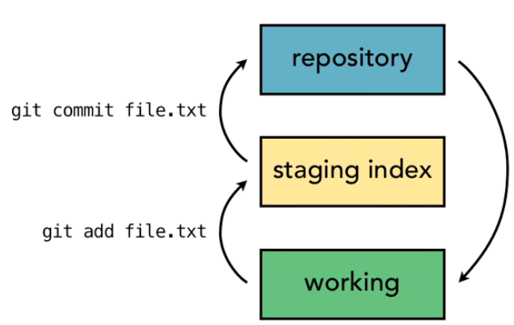
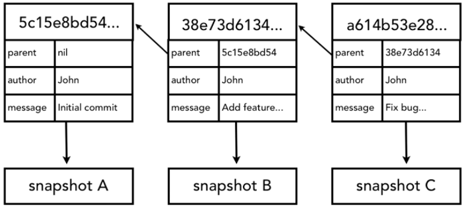

### GIT vs SVN
* Git is distributed (local repositories), SVN is central-repo
* Git is 3-tree, SVN is 2-tree
* Git tracks change sets, SVN tracks file changes


__________

## What is GIT?

### Understanding version control

GIT is a software that keeps tracks of changes on files and directories. And it is especially good in keepgin track of text changes.

Git allows us to compare different versions of a document: it is a VCS (Version Control System). Most times, VCS's are actually used for Software development, this is why they are also called SCM (Cource Code Management). 

Examples of Version Control in non-source code:
* File naming (budget_v4.xls, logo_Ed2.gif)
* MS Word's track cganges
* Adobe Photoshope's History
* Wikis
* Undo (CTRL+Z)

### The history of GIT

There are 4 main precursors to Git:
1. Source Code Control System (SCCS) - 1972 Unix
* Incremental changes
* Store v1 and then store the changes to apply
2. Revision Control Source (RCS) - 1982 open source
* Like SCCS, but backwards
* Stored last version, and decremental changes if we wanted to go backwards
3. Concurrent Versions System (CVS) - 1986-90, open source
* First to allow to work on more than 1 file
* Allowed distributed changes through central repository
4. Apache Subversion (SVN) - 2000, open source
* Faster than CVS
* Also allowed to save non-text files (images, etc.)
* Innovation: allowed to track changes and states of entire directories, not just files (exple: CVS would be lost if you renamed a file)

SVN was the most popular SCM until GIT appeared in 2005.
Linux was using a proprietary SCM (BitKeeper) for their Kernel releases, in its Community Edition. They used it because of a feature it had: Distributed Version Control. In 2005, BitKeeper Community Edition stopped being free, and Linus Torvalds himself created Git.

Git features
* distributed version contro
* open source and free
* compatible with Unix-like and Windows
* faster than other SCMs
* better safeguards against data corruption

### About distributed version control

Let's see why this feature is so important.

Other SCMs (CVS, SVN...) have a central repository. People can work concurrently on it, they create branches and commit changes to the central master repository.
Git, instead, does not have a main central branch, with which the other must be synced. It allows different teams to work on different versions, with different sets of changes applied to them. 
For example, let's imagine a set of 6 changes on a project: A, B, C, D, E, D:
* Repo 1: A, B, C, D, E, F
* Repo 2: A, B, C, D
* Repo 3: A, B, C, E
* Repo 4: B, D, E, F

None of them is right or wrong, they just have different sets of changes applied. At anytime, they can sync among them.
> By convention, there is actually a named "master" branch in Git projects. But this is a convention, not a requirement.

Advantages: 
* No need to communicate with a central server
	* faster
	* no network access required
	* no single failure point
* Encourages participation and "forking" of projects
	* developers can work independently
	* submit change sets for inclusion or rejection (without need to be synced always, or merged with the master)
	* very well suited for open source projects

> In Git architecture, there is not a central repository, all repositories are considered equal

### Who should use Git?

Primarily, code developers.
But actually, it's well suited to anyone wanting to track edits, or share them with collaborators

It's not that useful for tracking non-text files:
* images, movies, music, fonts
* word processor files, spreadhseets, pdf...

## Installing Git

On Linux:
https://git-scm.com/book/en/v2/Getting-Started-Installing-Git

### Configuring Git

There are 3 levels of configurations:
1. System --> /etc/gitconfig
2. User --> ~/.gitconfig
3. Project --> my_project/.git/config

We can set up configurations with the command `git config`

For example:
```
git config --global user.name "Ramon Peiro"
git config --global user.email "email@me.com"
git config --global core.editor "vim"
git config --global color.ui true
```
To view the current configuration: `git config --list`


__________

## Getting started

### Initializing a repository

We just need to go to the folder we want for our project and type
`git init`

This will create the .git folder

### Understanding where Git files are stored

Git creates a hidden folder .git/ at the top root of our project folder. Inside it, it stores all the files needed to track the repository.
If we wanted to stop tracking, we would simply delete this .git folder.

### Performing your first commit

Basically the process is:
1. make changes
2. add the changes: `git add .`
3. commit the changes: `git commit -m "message for the commit"`

### Writing commit messages

Best practices:
* short single-line summary (50 chars max.)
* optionally followed by a blank line and a more complete description (if many changes)
* keep each line to less than 72 chars
* write in present tense, not in past
* use * or - as bullet points
* add ticket tracking numbers if available
* can develop shorthand for your organization ([css, js])
* be clear and descriptive
	* bad: "update login code"
	* good: "change user authentication to use Blowfish"

### Viewing the commit log

`git log`

Options:
* -n N : outpu last N commits
* --since=YYYY-MM-DD
* --until=YYYY-MM-DD
* --author="ramon"
* --grep="commit"

Output:
```git
commit [unique_key]
Author: user.name
Date: [datetime]
	commit message
```


__________

## Git concepts and architecture

### Exploring the 3-trees architecture

A tree is a project folder, with subfolders and files

In a typical 2-tree architecture(like SVN), we have:
* repository
* working branch

In Git's 3-trees architecture, there's an intermediate stage:
* repository
* staging index
* working



The stage allows us to commit only a set of files within a change set.

### The Git workflow

This is the basic process we will follow:
1. new file 
	1. add the file to the working directory `file.txt`
	2. push changes to the staging index: `git add file.text`
	3. commit the set of changes `git commit`

In a typical workflow, changes are not only on single files, but rather to sets of files, folders, etc.

This workflow also applies for file editing.


### Using hash values (SHA-1)

Let's see how Git refers to its commits 


For each commit, Git generates a unique ID based on SHA-1 algorithm. It passes in all the changes committed and generates a 40-digit hexadecimal checksum. This checksum is the ID of the commit (the one we see with `git log`

### Working with the HEAD pointer

HEAD is an internal pointer Git uses to always point to the tip of the current branch in our repository. In other words, it's the last state of our repository (last thing we checked out). Therefore, it's the point from which it would start recording next commits.

If we are curious, we can see the contents of HEAD in `.git/HEAD`
Ultimately, it just points to the checksum of the last commit of our checkout. 
So this is good to demistify HEAD, it's just a pointer.


__________

## Making changes to files

### Adding files

`git status` gives us the current status of our working directory

We use `git add` to add files to the staging index

### Editing files

Once we understand how the staging works, we can modify files in our working environment, stage them and commit them.
In this movie we modify files 1 and 2 and commit them as a changeset.

### Viewing changes with diff

With `git status` we can see what has changed. With `git diff` we can see the actual changes. It works pretty much like UNIX's diff.
 We can also check changes on individual files with `git diff file1.txt`

> `git diff` shows changes between the repository and the working environment

`diff` has many options that we can use to customize. Check manual.

### Viewing only staged changes

To compare what we have in the stage vs. the repository we use
`git diff --staged`

> In older versions of Git < 1.6, staged was called cached

### Deleting files

Let's see how to delete files from the repo.

**Option 1**
Delete it in the WE and commit the changes.
1. First we delete the file in the working environment
2. We stage the change: file to delete. But to remove the command is `git rm file_to_delete.txt`. We cannot use "add", it will not work.
3. We commit the change (deletion) `git commit`

**Option 2** 
Delete the file directly in the repo
1. Delete the file directly in the staging environment: `git rm file_to_delete.txt`
2. `git commit`

The difference is that in Option 1, the file will be in the trash can of the OS. In Option 2 we do a Unix rm.
In both cases, the file will be kept in previous versions of the repo. 

### Moving and renaming files

Like for delete we have 2 options: do it in the OS or directly in Git.

**Option 1**
Rename it in the WE and commit the changes.
1. First we rename the file in the working environment
2. We stage the change. But interprets renaming as 2 step:
	3. delete file_old --> `git rm file_old`
	4. new file_new  --> `git add file_new`
3. We commit the change (deletion) `git commit`. Here Git understands it was a renaming, as long as data is at least 50% the same between both files.

**Option 2** 
Delete the file directly in the repo
1. Rename the file directly in the staging environment: `git mv file_old file_new`
2. `git commit`

Like for deleting, it's easier to do the changes directly in Git.


## Using Git with a real project

In this chapter we see some real action with a fictive project folder.

It's good practice that each commit relates to a specific set of changes. For example:
* "Change the contact details" would be one commit, even if on several files
* "Refactor loop" would be another commit

So we should commit changes as we develop them individually.


__________

## Undoing changes

### Undoing working directory changes

This happens when we are working in our file(s) in the WD, we modify them and we save them. If that was a mistake, we need a way to bring our files to a previous wanted status.

This can be done by retrieving the last version we had commited, ie, the one in the repository. We can retrieve it with `git checkout`

But *checkout* is used for 2 things:
1. Retrieve a single file/folder
2. Create a new branch

We will see branches later, but in order to tell Git that all we want is to retrieve a file we use "--":
`git checkout -- <file>`

This brings the file from the repo back to our WD.

> I think `git checkout -- <file>` does not work if there is something in the stage

### Unstaging files

Now let's see how to unstage files, ie, remove them from the staging area.

This happens typically when we are building a commit. We put our changes in the staging area for the commit, and maybe want to remove one we put in there accidentally.

To do this:
`git reset HEAD <file>`

### Amending commits

Git only allows us to edit the last commit we have done. Earlier than that we cannot, since that would break SHA1 data integrity.

We can either modify the contents of the commit (ie, the changes in the files), or just the commit message. Either way, it's:
`git commit --amend -m "message for the amended commit"`

This will **replace** the last commit.

### Retrieving old versions

As we have seen, we cannot undo an ancient commit. But what we can do is retrieve an old version, do changes on it (or undo them) and re-commit.

There are 2 ways:
1. manually (undo changes in files and commit)
2. checkout the last commit without the changes we want to undo
	1. `git log` to get the log tree
	2. copy the first 10 or son chars of the SHA1 of the commit we want to retrieve
	3. `git checkout <sha1> -- <file>`
	4. re-commit this checkout


### Reverting a commit

There is a simple way to undo the last commit:
`git revert <sha1>`
This will undo all the actions in the last commit backwards.

In case more difficult changes have been done (file renaming, etc) a revert may not be enough. Then we might need a merge (we will see that).

### Using reset to undo commits

`git reset` is a very powerful command that allows to undo multiple commits. It allows to set where the HEAD pointer points to.

> Use it with caution

Basically it sets HEAD at N commits back and then we start re-commiting from that point. There are 3 options related to it:
* --soft --> does not change staging index or WD, only modifies HEAD
* --mixed (default) --> changes stage index to match repo but not WD
* --hard --> changes both staging index and WD to match repo

When we use `git reset` to move HEAD around, it's a good idea to copy the log in a .txt

### Demonstrating a soft reset

`git reset --soft <sha1>`

If we do `git status` we will see that the reverted fles are in the staging area.
This option is the safest.

### Demonstrating a mixed reset

`git reset --mixed <sha1>`

### Demonstrating a hard reset

`git reset --hard <sha1>`

This option completely erases our work from the WD and the staging. It leaves the staging empty.

### Removing untracked files

Git provides an easy way to geet rid of unwanted files/folders in our WD that are not being tracked: `git clean` 

There are several options we can use:
* -n to have a test of what we would clean
* -f to force it to run (security measure)


__________

## Ignoring files

### Using .gitignore files

There may be some files we don't want to track (images, log files constantly changing, etc.)

Git provides a way to tell which files we want to not track: a UNIX text-like file named .gitignore
* we can use one line per file to ignore
* also basic regular expressions

Examples:
*.php --> ignore all files ending .php
!index.php --> except (do not ignore ) index.php
assets/videos/ --> ignore the contents of this folder

.gitignore itself must be tracked in the project (do not ignore it!)

### Understanding what to ignore

We typically want to ignore:
* compiled source code
* packages and compressed files
* logs and databases (files that change often)
* OS-generated files (.DS_store in Mac)
* user-uploaded assets (images, PDF, videos...)

Good resources:
https://help.github.com/articles/ignoring-files/
https://github.com/github/gitignore

### Ignoring files globally

Probably we will find ourselves ignoring the same files all the time, in all our projects. Rather than ignoring everything all the time in every project, we can configure Git to ignore files globally, for all the projects.

These configurations will be user-specific.

To set it up:
`git config --global core.excludesfile <filename>`
`<filename>` can be named anything we want, for example: `~/.gitignore_global`

### Ignoring tracked files

Ignoring files works for files we have not tracked/commited yet. If we want to ignore files that have been previously tracked so far, we first have to untrack them.

To do so: `git rm --cached <file>`

### Tracking empty directories

Git is designed to be a file-tracking system. Therefore it tracks files, and it tracks the directories it takes to get to files, but it ignores directories with no files.

So the trick we use is to put at least a file in the directory. By convention, people usually names this file either `.gitignore` or rather `.gitkeep`

In Unix/Linux a simple `touch .gitkeep` will be sufficient.


__________

## Navigating the commit tree

### Referencing commits

There are several ways to reference commits in Git:
* full SHA1 hash
* Typically enough 8-10 first chars of the SHA1 guarantee they are unique
* HEAD pointer (always points to the commit at the tip of the currently checked out branch)
* branch reference, tag reference
* refer to an object's ancestry (with ^ or ~): HEAD~N refers to N-th grandparent

In Git, *tree-ish* is something that references part of the tree. In its simplest term, it's a reference to a commit.

### Exploring tree listings

A tree is like a directory listing. 
We can list the contents of a tree with `git ls-tree <tree-ish>`

Everything in Git is either a blob (file) or a tree (directory). Each has its own SHA1 that we can reference (they are also tree-ish)

### Getting more from the commit log

`git log [option]` has many useful options we can use:

| Option | Description |
| --- | --- |
| --oneline | Displays a summarized 1 line per commit with reduced SHA1 |
| -n | Lists only the last n commits |
| --since="YYYY-MM-DD" | Filter per date >=
| --until="YYYY-MM-DD" | Filter per date <=
| --author="Ram" | Filter per who performed the commit (grep) 
| --grep="string" | grep "string" in the commit messages
| \<sha1-A>..\<sha1-B> | Filter between commit \<sha1-A> and commit \<sha1-B>
| \<filename> | Filter commits that affect only \<filename>
| -p | Patch option, displays a diff between commits
| --stat | Displays statistics about changes
| --summary | Displays a summary about changes
| --format=\<OPTION> | oneline - Displays a summarized 1 line per commit with full SHA1<br/>short, medium, full, fuller, email, raw |
| --graph | Shows a graph of each commit, with branches

A good typical command is `git log --oneline --graph --all --decorate`

### Viewing commits

We can examine a specific commit with `git show <tree-ish>`

### Comparing commits

When comparing commits,we compare the actual status of each commited project, not just the snapshots of the changes of each commit. 

`git diff <sha1>` displays the differences between the \<sha1> commit and the WD.
`git diff <sha1> <filename>` displays the differences between the \<sha1> commit and the WD, only for the \<filename>
`git diff <sha1>..<sha2>` displays the differences between the two commits

Useful options for diff:
* --stat --summary
* -b --> ignores space changes
* -w --> ignore all spaces


__________

## Branching

### Branching overview

In Git, branches are cheap. Easy to create and work with. Git encourages usage of branches to:
* try new ideas
* isolate features or sections of work

### Viewing and creating branches

`git branch` show the branches available. An '*' marks the current branch (checkout)

`git branch <new_name>` creates a new branch named \<new_name>

Right after creation, the branch is created but:
* it points to the same HEAD until we commit it
* our current branch is still the previous until we switch

### Switching branches

`git checkout <new_name>` to switch to the new branch

### Creating and switching branches

`git checkout -b <new_name>` to create a new branch and switch to it at the same time

### Switching branches with uncommited changes

Git won't let us switch a branch (checkout) if we have unsaved files in our WD *with conflicting changes*. We have then 3 options:
1. Discard the changes (checkout the file)
2. Commit the changes
3. Stash the changes (save them for later)

### Comparing branches

`git diff <branch1>..<branch2>` allows us to compare 2 branches

Nice options:
* --color-words

`git branch --merged` displays all the branches that are already included in our current branch

### Renaming branches

`git branch -m <old_name> <new_name>` allows us to move/rename existing branches

### Deleting branches

`git branch -d <branch>` allows us to delete an existing branch

Notes:
* we cannot delete the currently checked out branch
* we cannot delete branches with unmerged changes (we have to use -D option)

### Configuring the command prompt to show the branch

[TODO]


__________

## Merging branches

### Merging code

Merging is the action of bringing changes done in one branch, onto another.

The process is simple:
1. we must check out the branch that is going to *receive* the changes
2. make sure the WD is clean
3. `git merge <branch_to_merge>`

### Using fast-forward merge vs. true merge

A *fast-forward* merge is when we merge a branch into a receiver, without having modified the receiver branch wrt to the merged one.

This is equivalent to committing a new change.

Options:
* --no-ff --> do a commit anyway
* --ff-only --< do the merge only if can do a fast-forward, otherwise abort

A *true merge* happens when there have been more commits in the receiving branch since the checkout. 

### Merging conflicts

git does a very good job at figuring out how to automatically resolve merges.

But conflicts arise when 2 commits modify the same line(s).

If we try and merge 2 conflicting branches, Git will stop us at an intermediate step, and will point out the conflicts. We identify the intermediate state by a new prompt *(branch[MERGING])*.

### Resolving merge conflicts

When we face conflicts, we have 3 choices:
1. abort merge
2. resolve the conflicts manually (most times we will do this)
3. use a merge tool (we won't see it here)

To abort the merge we do `git merge --abort` from the intermediate state

To resolve the conflicts manually we will have to go line by line and modify the conflicting files

Now again we can do `git log --oneline --graph --all --decorate` to display a nice graph of our branches

### Exploring strategies to reduce merge conflicts

Some tips to avoid complex merges:
* keep lines short
* keep commits small and focused (do not commit too many different changes at once)
* beware stray edits to whitespace (spaces, tabs, line returns)
* merge often
* track master changes in our branch often (stay in sync with master branch and not deviate too much)


_______________________

## Stashing changes

### Saving changes in the stash

The stash is a place where we can save files temporarily if we don't want to commit them to the repository. It's a special 4th area in Git, separate from the repo, the WD and the staging index.

The changes we put in the stash are a lot like commits, but without an associated SHA1

Typical application is when we have some changes in the WD and we want to checkout another branch (master) to see what is contains. If we are not ready to commit, but want to keep the changes from the WD we can do `git stash save "<message>"`

### Viewing stashed changes

To view changes in the stash we do `git stash list`

This returns items with a reference *stash@{number}*
To display a specific stash: `git stash show [-p] stash@{0}`. The -p option displays the edit differences.

> The same stash is accessible from any current branch we check out

### Retrieving stashed changes

To bring our changes back to the WD (load the stash) we do `git stash pop stash@{0}` or `git stash apply stash@{0}`
The difference is that `pop` loads and deletes from the stash, while `apply` loads and leaves the copy in the stash

Typically we will use `pop`

> If we have something in the WD and retrieve the stash, we may have to deal with conflicts, just like in a merge

### Deleting stashed changes

To delete something from the stash we do `git stash drop stash{0}`

If we want to clear the stash completely we can do `git stash clear`


______________

## Remotes

### Using local and remote repositories

So far, all we have done with Git has been locally in a PC. 
We can also workwith remote repositories, which are nothing more than another Gitrepo, which is located on a server accessible through the Internet.

This server can be used by distributed teams to share their changes, using the remote repo as a central repo, but this is only a convention. Git is ditributed, so the remote repo is just like a local one.

When we upload our local branch to the remote repo, it's called a *push*
When we download the remote repo branch to our local branch, it's called a *fetch*

Locally, we have 2 branches:
* our checkout
* a branch called *origin*, where Git fetches changes from the remote repo

To bring those changes to our checkout, we have to merge the *origin* branch into the checkout

so generally speaking, the process when working with remote servers will be:
1. make our commits locally in our *master* branch until we are ready to push
2. fetch from the remote repo to our *origin* branch
3. merge *origin* onto *master*
4. push the result back up to the remote repo

### Setting up a GitHub account


### Adding a remote repository

In order to connect to a remote repo, we have to have it created first in the remote server.
Then we need to add it locally so that Git knows where to find it. We do so with:
`git remote add <alias> <url>`

\<url> is the HTTPS URL provided by the remote server

> Typically we will use *origin* as \<alias>

Once added, we can see the remotes in our project with `git remote -v`
We can have several remotes, not just one.

To remove it: `git remote rm <alias>`

### Creating a remote branch

`git push -u <remote> <local>` let us push our \<local> branch onto the equivalent \<remote> one.

The -u option indicates Git that we want to track the \<remote> branch
The \<remote> branch is actually our local *origin* branch. It's stored in .git/refs/remotes
Remote branches are configured in .git/config

`git branch -r` displays the remote branches
`git branch -a` displays all the branches

### Cloning a remote repository

Let's see the reverse procedure. Clome a remote repo to work on it locally. 

1. We get the URL of the GitHub repo we want to clone: https://github.com/moltaweb/courses.git
2. We cd to our local container folder and do `git clone [-b] <url> [<name>]` (by default *name* will be the same as in GitHub, but we can change it)

-b option let's us choose the branch we want to clone, by default it will be the master branch. Git automatically tracks locally the remote branch (smilarly to `git push -u`)

### Tracking remote branches

We can track remote branches with -u option in push
When we clone a remote repo it's tracked automatically

### Pushing changes to a remote repository

Once we are tracking a remote branch, we can simply push changes with `git push`

### Fetching changes from a remote repository

We fetch a remote branch with `git fetch <remote>`
If we are tracking only one remote branch, we can simply fetch changes with `git fetch`

Note that fetch only updates our local branch for the remote repository (*origin*), it does not mess with our local *master*. Fetching is not harmful at all.

There are 3 simple rules to follow:
1. fetch before you work
2. fetch before you push
3. fetch before leaving Internet connection
4. fetch as often as possible

### Merging in fetched changes

When we fecth, we only update the *origin* branch, not the *master* one. Therefore, if we want to bring those changes into our own *master*, we have to do a merge.


### Checking out remote branches

### Purhing to an updated remote branch

### Deleting a remote branch

### Enabling collaboration

### A collaboration workflow


__________________

<!-- reference to stylesheet -->
<link rel="stylesheet" href="./css/md-styles.css">