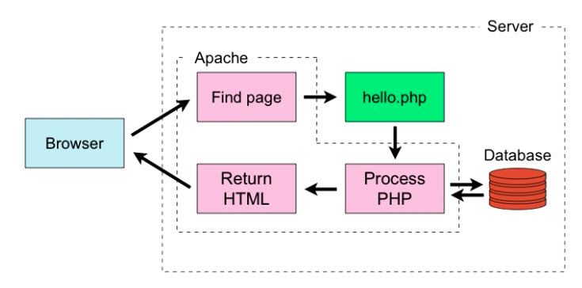

# PHP Essential Training

## FIRST STEPS

  
### Embed PHP code on a page

PHP code goes bewteen opening and closing tags

`<?php phpinfo(); ?>`

There are other forms/shortcuts, but they are generally abad idea

This one is the most standard and portable  

These tags allows us to jump on/off the PHP mode

Basic syntax:

-   whitespaces don't matter
-   statements end with ";"
-   files MUST end with .php, otherwise Apache interpreter will not process them  

### Output dynamic text

We print text to the browser with the "echo" command

The single most important command in PHP

`<?php echo "Hello world!";?>`

The period "." allows to concatenate strings

`<?php echo 2+3; ?>`

outputs 5
 
### The operational trail

Overall the process is as follows, it's good to have it in mind when we see HTTP redirects, etc.
 



### Insert code comments

```php
// single-line comments_
# single-line comments_
/* double-line comments_
enter code here
are written like this */_
```

Comments are not output to HTML


## EXPLORE DATA TYPES

### Variables

Rules

-   start with $
-   start with a letter or an _
-   can contain letters, numbers, _ and -
-   no spaces
-   case sensitive

Some keywords are reserved and cannot be used:

<http://php.net/manual/es/reserved.php>

### Strings

Strings can be either in single quotes 'This is a string'
or in double quotes "This is a string"

HTML tags inside the string is passed to the HTML doc

Good thing about " " is that it accepts variables

`echo "$myVar"`

outputs the string in $myvar

It's equivalent to
`echo "{$myVar}"`
which is better because we don't need to put a space

### String functions

We can concatenate and assign at the same time:
```php
$sentence3 = $sentence1;
$sentence3 .= $sentence2;
```

Some interesting functions

| Function | Description | 
| --- | --- | 
| strtolower | 
| strtoupper | 
| ucfirst | First word capitalized
| ucwords | all words capitalized
| strlen | Length of the string
| trim | removes white spaces
| strstr( string, substring) | Find a substring inside a string, from the first position of the substring
| str_replace( str_to_replace, replace_with, string ) | 
| str_repeat | 
| substr | 
| strpos | Find indexposition
| strchr | Find character

More info :
 <http://php.net/manual/es/ref.strings.php>
 

### Numbers, part 1: Integers

Integers are whole numbers

Operators
| Function | Description | 
| --- | --- | 
| + | 
| - | 
| * | 
| / | 
| += | 
| -= | 
| *= | 
| /= | 
| ++ | $var++;
| -- | 

Operator precedence is as usual

Some functions

| Function | Description | 
| --- | --- | 
| abs | 
| pow | exponential
| sqrt | 
| fmod(20, 7) | Modulo, returns 6
| rand() | Returns random number
| rand(1, 10) | Returns randome number within range
| is_int( nb ) | Returns boolean
| is_numeric( nb ) | Returns boolean

> PHP will do its best to convert strings to integers
> `<?php echo 1 + "2"; ?>`
> returns 3
  
### Numbers, part 2: Floating points

Floating point numbers (aka floats) are decimal numbers
Programming languages treat integers ans floats differently because they are stored in different ways in memory, beause of decimals management

| Function | Description | 
| --- | --- | 
| round( $var, decimals) | 
| ceil( $var ) | Round up (ceiling)
| floor( $var ) | Round down
| is_float( nb ) | Returns boolean
| is_numeric( nb ) | Returns boolean

We can add floats and integers
> Division by 0 returns a PHP warning


### Arrays

An array is an ordered, integer-indexed, collection of objects
To declare an array:
```php
$numbers = array();
$numbers = array(5, 6, 7, 8, 9);
$numbers = [5, 6, 7, 8, 9]; // only from version PHP 5.4
echo $numbers[1]; // returns 6

// Mixed arrays
$mixed = array(6, "fox", "dog", array("x", "y", "z"));
echo $mixed[2]; // returns "dog"
echo $mixed[3]; // returns an error
```
We should use print_r(); to display an array contents
```php
echo print_r( $mixed );
echo $mixed[3][1]; // returns "y"

// Assign values
$mixed[2] = "cat";
$mixed[] = "last"; // appends at the end of the array
```
Arrays are ordered, so they're wonderful to store information


### Associative arrays

An array is an object-indexed, collection of objects

They differ from regular arrays in that:
* They are unordered
* They are key-indexed instead of integer (key-value pairs)

```php
$assoc = array();
$assoc = array("first_name" => "Kevin", "last_name" => "Skoglund");
echo $assoc["first_name"]; // returns "Kevin"

// Assign values
$assoc["first_name"] = "New name";
```
Actually, keys can be anything, not necessarily Strings, but also integers
Therefore
```php
$numbers = array(5, 6, 7, 8, 9);
```
is equivalent to
```php
$assoc = array(0 => 5, 1 => 6, 2 => 7, 3 => 8, 4 => 9);
```

### Array functions

There are a lot of functions to work with arrays
Some common functions:
| Function | Description | 
| --- | --- | 
| ( $array ) | 
| count( $array ) | count items in the array
| max( $array ) | Max value
| min( $array ) | Min value
| sort( $array ) | Sort values
| rsort( $array ) | Reverse sort values
| implode( $char, $array ) | Construct a string from an array, separating items with $char
| explode( $char, $array ) | Construct an array from a string, separating items with $char
| in_array( $var, $array ) | Boolean, returns if $array contains $var
| array_keys( $array ) |
| array_values( $array ) |
| array_push |
| array_pop |
| array_shift |
| array_unique | Removes duplicates
| array_search |
| array_rand |

More info: <http://php.net/manual/es/ref.array.php>


### Booleans

A Boolean is a variable that contains either the value true or false

The following are equivalent
| Boolean | Values | 
| --- | --- | 
| TRUE | True, true, 1
| FALSE | False, false, NULL, 0, 0.0, ""

Useful functions:

| Function | Description | 
| --- | --- | 
| is_bool ( $var ) | Returns true if $var is a boolean itself


### NULL and empty

NULL is the lack of value in a variable

In PHP, it can be either `NULL` or `null`
We can check if a value is null with the `is_null( $var )` function, which returns a boolean

Alternatively, the function `isset( $var )` checks if a variable is defined

Finally, the function `empy( $var )` checks if a variable is empty. PHP considers "empty" the follwoing:
- " "
- null
- 0
- 0.0
- "0"
- false
- array() (empty array)

This catch-all approach can be very useful, but we have to be careful to handle it. empty() function leads typically to many bugs in PHP

### Type Juggling and Casting

Type Juggling is when PHP does a type conversion automatically for us, for example in :
`echo 3 + "2";`

Juggling depends on the operators, for example:
* integer + string -> integer
* integer . string -> string

Type Casting is when we convert types manually:
`settype( $var, "integer"); // this changes the type of $var permanently`
or
`(integer) $var; // this modifies the type temporarily, only for the statement`

Types:
 * string
 * int, integer
 * float
 * array
 * bool, boolean

We can check the type in several ways:
* boolean functions
	* is_string()
	* is_int()
	* is_float()
	* is_bool()
* retrieve the type
	* gettype()


### Constants

A constant is the opposite of a variable. It contains a constant value

`define( "MAX_WIDTH", 980);`

Notes:
* we define the name within " ", otherwise it's being called
* we can't change the value after defined, we will get an error
* we can't even redefine it

The scope of constants and variables is the execution of the PHP script. When HTML is returned to the brower, the values are reset.


## CONTROL STRUCTURES: LOGICAL EXPRESSIONS


### IF statements

They allow us to execute a pieceofcode basedon a certain condition

```php
if (expression) {
	// code
}
```

### ELSE and ELSEIF statements

```php
if (expression) {
	// code
} elseif {
	// alternative code
} elseif {
	// ......
} else {
	// final code
}
```
We can add as many "elseif" blocks as we want


### Logical operators

Here we focus on the "expression" (condition) in the logical expression

Operator | Description
--- | ---
== | Equal (123 is considered equal to "123")
=== | Identical (same type also)
\> / >= | Greater then
\< / <= | Lower than
 != | Not equal
 !== | Not identical
 && | And
 \|\| | Or
 ! | Not

### Switch statements

Similar to IF-ELSEIF-ELSE statements

Syntax:
```php
switch (value) {
	case test_value1:
		statement;
		break;
	case test_value2:
		statement;
		break;
	...
	default:
		statement;
}
```
Each case compares for value equality
If we dont set `break;`, every case will be executed, because every line below the matched case is executed. 


## CONTROL STRUCTURES: LOOPS

Loops are structures that allow us to execute the same block of code repeatedly
In all loops we need an end condition to avoit infinite loops

### WHILE loops

```php
while (expression) {
	statement;
	// we need an end condition to avoid inifinite loop
}
```

### FOR loops

```php
for (expr1; expr2; expr3) {
	statement;
	// we need an end condition to avoid inifinite loop
}
```
`expr1` is the initial condition
`expr2` is the condition test
`expr3` is is executed on each iteration
Example: `for (i=0; i<10; i++)`


### FOREACH loops

Foreach loops allow us to loop over every item of an array

```php
foreach ($array as $value) {
	statement;
	// we need an end condition to avoid inifinite loop
}
```
`$value` is just an ad-hoc variable that refers to the array element being accessed on every iteration
Here we don't need incremental counters and testing iteration conditions, since the `foreach` loop automatically iterates through the elements of the array
We could of course use while of for loops instead, butforeach is much more direct and simple for arrays.

For associative arrays:
```php
foreach ($array as $key => $value) {
	statement;
	// we need an end condition to avoid inifinite loop
}
```

### Continue

`continue` is used inside a loop to skip the rest of the current iteration and jump to the condition evaluation that starts the next iteration

> Example of application: let's imagine that we have a database of college students,  and our code is going to loop though them  and send them all an email.  But if the student is already signed up  for a biology course this semester, then we aren't going to send them the email.

In the case of nested loops with `continue`, we can specify to which parent loop we want to jump over: `continue(n)` jumps to the next iteration of the n-th parent loop, while `continue` would be equivalent to `continue(1)`.

### Break

We use `break` to stop execution of the current iteration and exit the loop.

> Application example: we are looking for something in a list. Once we find it, we `break` and keep moving.

Like for `continue`, in the case of nested loops with `break`, we can specify to which parent loop we want to jump over: `break(n)` jumps to the next iteration of the n-th parent loop, while `break` would be equivalent to `break(1)`.


### Understanding array pointers

When looping through an array, PHP uses a pointer that points tothe current item being evaluated. 

We too can move that pointer and use it to access the elements of the array. By default, the pointer points at the first element.
`current($array)` returns the value of the item where the pointer is
`next($array)` moves the pointer to the following item
`prev($array)` moves the pointer to the previous item
`reset($array)` moves the pointer to the first item
`end($array)` moves the pointer to the last item

This is similar to how `foreach` works. For example:
```php
$ages = [12, 13, 16, 18, 21, 25, 28, 30];
// we directly assign each time the current value of $ages. If it doetsn't exist, 
// it will be null and $age will be False, exiting the loop
while ($age = current($ages)) { 
	echo $age . ", ";
	next($ages);
}
```
We introduce this concept because when we work with databases, we have to do it like this, because database pointers do not allow to do a `foreach`.


## USER-DEFINED FUNCTIONS


### Define functions

A function is a piece of code that performs a specific task,packaged into a single unit, that can be called anytime we need to execute that code.
We can use PHP's built-in functions, but we can also create our own.

The syntax is:
```php
function name($arg1, $arg2, ...) {
	// code
}
```
Afterwards, we call the function with `name($arg1, $arg2, ...)`

> Until PHP 3, we had to define our functions before being able to call them. From PHP 4, we can define it after calling it, because PHP pre-processes the entire .php file in search of functions. Still, it's a good practice to define it before, just for readability.

We cannot declare the same function twice, we will get an error.


### Function arguments

When declaring a function with multiple arguments, order matters!
We may pass `null` as an argument, but there must be as many arguments as there are parameters.

### Return values from a function

Functions may return a value or not (void).

When returning a value, we can catch that value in a vartiable and work with it.  We use the `return` keyword. Example:
```php
function add($val1, $val2) {
	$sum = $val1 + $val2;
	return $sum;
}
echo add(2,3);
```
It is considered a best practice to always return values from functions in PHP. If there is no explicit return, PHP will return `null` by default.

> `return` automatically exits the function


### Multiple return values

`return` can only return a single value
If we want to return multiple values, we have to do it in an array, using the `list()` function.

```php
function add_subt($val1, $val2) {
	$add = $val1 + $val2;
	$sub = $val1 - $val2;
	return array($add, $subt);
}
```
Normally we could retrieve the values with
`$result_array = add_subt(10, 5);`
and we would access the sum with `$result_array[0]` and the substraction with `$result_array[1]`

But with `list()` we can name them something more explicit:
`list($add_result, $sub_result) = add_subt(10, 5);`
and we would access the sum with `$add_result` and the substraction with `$sub_result`


### Scope and global variables

A declared variable isn't accessible everywhere, only within a certain context: its scope.
In PHP there are 2 scopes:
* *global* scope
* *local* scope

Variables inside functions are local to the function. To access a global variable inside a function we use the keyword `global`
But in most cases, rather than declaring *global* inside a function, we will pass the variales as an argument and return its value.

### Set default argument values

When we declare a function with a given number of parameters, we must call it always with the same number of arguments. Unless we set default arguments.

Examples:
```php
function paint($room="office", $color="red") {
	return "The color of the {$room} is {$color}."
}

echo paint();
// returns "The color of the office is red."
echo paint("bedroom", "blue");
// returns "The color of the bedroom is blue."
echo paint("bedroom", null);
// returns "The color of the bedroom is ."
echo paint("first");
// returns "The color of the first is red."
```
As seen in the last example: the order matters. Therefore, we should put optional (default) arguments at the end in the declaration.


## DEBUG

### Common problems

| Problem | Troubleshooting |
| --- | --- |
| No output at all | 1) Check HTML pages to see if server is ok<br/> 2) Check phpinfo() to see if PHP is running<br/>3) Check if display errors is ON

Common PHP errors:
- typos
- missing semi-colon
- missing closing braces/quotes
- case-sensitive varoable names
- mis-use = and == (if ($count=3) is TRUE)


### Warnings and errors

First: turn on error reporting. 
* In php.ini `display_errors = On` and `error_reporting = E_ALL` 
* In our PHP file: `ini_set('display_errors', '0n');` and `error_reporting(E_ALL);`

http://php.net/manual/es/ref.errorfunc.php

```php
// E_STRICT included in E_ALL from 5.4
// for PHP 5.3 and below
error_reporting(E_ALL | E_STRICT);

// Use ~ to omit
error_reporting(E_ALL & ~E_DEPRECATED);

// return the current level
error_reporting();w
```

Broadly, there are 4 categories of errors:
1. Fatal errors
	- PHP understood the code but could not execute it
	- Ex: undefined variable
2. Syntax errors
	- PHP could not understand or process the code
	- Ex: missing ";"
3. Warnings
	- PHP found a problem, but was able to recover
	- Ex: divide by 0
4. Notices
	- PHP is offering advice

Beware to turn off error reporting in production

Normally logs will be kept in the server with errors in runtime


### Debug and troubleshoot

Tips for debugging:

| Function | Description
| --- | --- |
| echo $variable | print out the value of the variable
| print_r($array) | print array in readable format with \<pre>
| gettype($var) | return the type of the variable
| var_dump($var) | echo info about the variable: type, value, nice format if array
| get_defined_vars() | return an array with all the variables defined at a given moment
| debug_backtrace() | return the stacktrace of function calls at certain point. Useful with `var_dump(debug_backtrace());`

PHP does not have an official debugging tool. Popular 3rd party options:
* Xdebug (<http://xdebug.org>)
* DBG (<http://www.php-debugger.com/dbg/>)
* FirePHP (<http://www.firephp.org>)


<!--stackedit_data:
eyJoaXN0b3J5IjpbLTExMDc3MDIwMjhdfQ==
-->