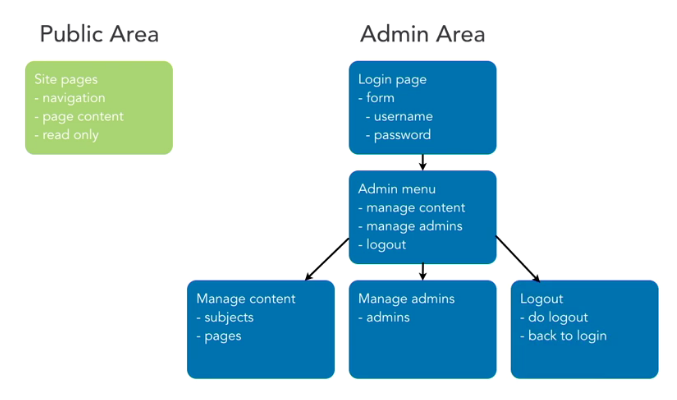

# PHP and MySQL - PART 1

## Start a Database-driven project

### Blueprint the application

We want to build a basic CMS



Blueprinting is a good practice:

* Highly recommended as a first step
* Draw diagrams or write up notes on the structure
* Clarifies the work ahead
* Detects obstacles and points confusion early
* Unclutters your brain
* Makes it easier to develop section by section
* Provides a constant reference for how sections fit into the whole project


### Establish your work area

Kevin uses a similar structure for all projects:

* home_folder/
	* public/
		* index.php
		* images/
			* index.php
		* stylesheets/
			* index.php
	* private/
		* initialize.php
		* functions.php
		* shared/

> Personally, I prefer all assets (img, css, js) inside a common folder assets/

Everything that is supposed to be accessed would be in public/  
The web server is going to be configured so that routing requests go to public/  
private/ cannot be accessed through any URI by the public
However, php files in public/ will be able to access private/ folder through the filesystem

> Every folder in the public/ directory should have an `index.php` file to prevent access to folder contents (depends on the web server configuration

Inside public/, there are several ways to organize files. Kevin proposes this one to manage *pages* and *subjects*:
* pages/
	* index.php (list)
	* edit.php
	* show.php
	* delete.php
	* new.php
* subjects/
	* index.php (list)
	* edit.php
	* show.php
	* delete.php
	* new.php


### Create and style the first page

In this part 1 we will concentrate on the staff/ area inside public. No authentication for the moment, that in part 2.

In this video we create `public/staff/index.php`, a basic HTML page with:
* head and body
* simple navigation menu
* footer with some PHP for the date (to test PHP)
* CSS link in head


### Include and require files

One of the most useful features of PHP is the ability to include PHP code contained in other files. This helps to DRY and improves maintenance.

Typical things we want to include:
* libraries of functions
* header, navigation, footer, etc.
* scripts, styles, analytics tag, etc.

There are 4 mechanisms to include code:
* include()
* require()
* include_once()
* require_once()

`require()` will raise an error, `include()` will not  
`_once()` will check if it has already been included and if so, it won't include it again. 

* for functions, we want include_once/require_once, because functions cannot be declared twice
* for exple for ads to display in different places of the page, we will want include/require, because we DO want to include them several times

> Always use static strings inside includes, because otherwise we could have major security issues if we allow someone to put files in our folders

In the video, we create `functions.php` and `initialize.php`. We include those in the header.
Also we start making page assets reusable by putting head and footer in separate files `staff_header.php` and `staff_footer.php`.

> We start to distinguish the difference in accessing resources in the server: URL vs. Filesystem


### Make page assets reusable

First thing to note is that in here:

```php
<?php $page_title = 'My Title'; ?>
<?php include('header.php'); ?>
```

The variable `$page_title` is available inside the included code below. Its like if the contents of `header.php` were pasted exactly there.

In the top of `header.php` we make sure the variable is defined before we use it, just in case:

```php
if ( !isset($page_title) ) { $page_title = 'Default title'; }
```

Second thing, very important, is to define global constants with the project paths, so we can re use them in all our includes.

In `initialize.php`: 

```php
// __FILE__ returns the path to the current file
// dirname() returns the path to the current directory
define("PRIVATE_PATH", dirname(__FILE__));
define("PROJECT_PATH", dirname(PRIVATE_PATH));
define("PUBLIC_PATH", PROJECT_PATH . '/public');
define("SHARED_PATH", PROJECT_PATH . '/shared');
```

> These are paths in the filesystem

This helps us avoid to have `../../path/to/file` in every file and mess with the `../`  
But so far, still we will need the dots to include `initialize.php`


_______________________________

## Build Web Pages with PHP

### Links and URLs

There is no such thing as a PHP link. Links are HTML. PHP only ouptuts the contents of the link:

```php
<a href="<?php echo 'index.php'; ?>">Menu</a>
```

Here we have the same problem as we had with the stylesheets. The URL's are relative, so we need to define a constant to set our root URL. There are several options:

```php
// Assigne the root URL to a PHP constant
// We do not need to include the domain, we can just use the sme document root as the webserver
// Can set either a hardcoded value:
define("WWW_ROOT", 'path/to/webserver');
// If we are in production server:
define("WWW_ROOT", '');
// Or we can dynamically find everythin in the url up to "/public"
$public_end = strpos($SERVER['SCRIPT_NAME']. '/public' + 7);
$doc_root = substr($SERVER['SCRIPT_NAME']. 0, $public_end);
define("WWW_ROOT", $doc_root);
```

Kevin uses this function in `functions.php` to obtain the URL from any file:

```php
function url_for($script_path) {
  // add the leading '/' if not present
  if($script_path[0] != '/') {
    $script_path = "/" . $script_path;
  }
  return WWW_ROOT . $script_path;
}
```

### Use URL parameters

URL parameters are the part of a URL after the `?`. Example:  
`somepage.php?key1=value1&key2=value2`

When we request a page with URL parameters, these are automatically stored in a super global variable: `$_GET` (assoc array)

> There are 9 super globals in PHP, they are available in all variable scopes and assigned by PHP before processing any page code
> To access them: `$value1 = $_GET['key1']
> $value1 is always stored as a String. We have to cast it if we want to use it otherwise

In the app, we create a fake assoc array that simulates database records. We construct a table with the columns in the `index.php` page (list page):
* ID
* Position
* Visible
* Name
* View / Edit / Delete (links)

Now we want to construct the `show.php` page (View link). And as we want this page to display each specific record, we do it in to steps:

1. We pass the ID as a URL parameter in the `index.php` page:

```php
<a class="action" href="<?php echo url_for('/staff/subjects/show.php?id=' $subject['id']); ?>">View</a>
```

2. We retrieve the ID in the `show.php` page to display the details of that particular ID:

```php
$id = $_GET['id'];
```

### Default values for URL parameters

A good practiceis to anticipate the possibility that we do not receive a URL parameter in `show.php`

An easy option is to use a conditional statement, typically in ternary operator:

```php
$page = isset($_GET['page']) ? $_GET['page'] : 'default'

// Even shorter: only in PHP 7
$page = $_GET['page'] ?? 'default'
```

### Encode URL parameters

We need to handle data that could include some URL special characters. For example, a URL parameters could contain `&`, or `;`, or a space, etc.  
https://en.wikipedia.org/wiki/Percent-encoding

We need to convert those characters so that the URL is not broken. PHP provides 2 functions for that: `urlencode($string)` and `rawurlencode($string)`. In both cases:
* Letters, numbers, underscore and dash are unchanged
* Reserved characters are encoded
* Difference in encoding spaces:
	* *urlencode*: space becomes `+`, normally used in query string
	* *rawurlencode*: space becomes `%20`, normally used in path encode

> These functions have their equivalents for decoding: `urldecode($string)` and `rawurldecode($string)`. But we will rarely use them, because PHP applies them automatically when retrieving a URL.

KEvin uses a function in `functions.php` to make it shorter:

```php
function u($string="") {
	return urlencode($string);
}
```

### Encode for HTML

We also need to handle data that could include special HTML characters.

Lest's imagine we have this:

```html
<?php $username = "Kevin"; ?>
<div id="name"><?php echo $username; ?></div>
```

If in the form we do not encode `$username`, a user could input some HTML or JavaScript in it (Cross-site scripting XSS).   
HTML encoding replaces `<`, `>`, `&` and `"`

We use this function: `htmlspecialchars($string)`

> We should apply this function anytime we receive data from a user


______________________

## Headers and Redirects

### Modify headers

The web server adds a small amount of information in the HTTP response sent to the browser, regarding the HTML code that follows. This is known as the header. An example of header:

```
HTTP/1.1 200 OK
Date: Thu, 28 Feb 2019 03:21:16 GMT
Server: Apache/2.4.23
Content-Type: text/html; charset=utf-8
Content-Length: 52839
Connection: close
```

Normally this header information is generated automatically by the server. But we can also pass some header information with the PHP `header($string)` function.

> Headers are sent before any other page data. Changes must be made before any HTML output

Example of header modification:

```php
function error_404() {
  header($_SERVER["SERVER_PROTOCOL"] . " 404 Not Found");
  exit();
}

function error_500() {
  header($_SERVER["SERVER_PROTOCOL"] . " 500 Internal Server Error");
  exit();
}
```

### Page redirection

Page redirects is an essential skill in Web Development. They are declared in the HTTP headers.

Redirects have a specific server code: 300
* 301: permanent redirect
* 302: temporary redirect

We can tell the browser to automatically redirect with the `header("Location: new-page.php")` function

Redirection can be done at page load, but also in the middle of some code processing (exple: E-commerce redirection to confirmation page)


### Output buffering

The problem we face is that headers must be modified before any HTML is processed. Therefore, we cannot create a redirect after HTML code is present on the page. To help us we can use *Output Buffering*

> Output Buffering can be turned on/off in `php.ini` (it is ON by default), or with a PHP function `ob_start()`


______________________

## Build forms with PHP

### Build forms

There 2 main ways to interact with a website through HTTP:
* URLs/Links --> GET
* Forms --> POST

Typically GET is used to receive information from the server, whereas POST is used to send data.

Typically a form looks something like this: 

```html
<form action="register.php" method="post">
    <input type="text" name="city" value="" />
	<input type="text" name="state" value="0" />
	<input type="text" name="zipcode" value="1" />
	<input type="submit" value="Send Form" />
</form>
```

Important note on checkbox field. Typically we will do this:

```html
<form action="register.php" method="post">
    <input type="hidden" name="consent" value="0" />
	<input type="checkbox" name="consent" value="1" />
</form>
```

The way HTML works is it will send the value of the checkbox=1 if the checkbox is checked.Otherwise it will post nothing. so for us to know that the user did not check the checkbox, we precede with a hidden field. If the user checks it, it will overwrite the default.

In this video we create 2 pages:
* `new.php` with a form to create a new subject
* `edit.php` with a form to modify an existing subject

> In `edit.php` we will prepopulate the form fields with actual content from the database


### Use form parameters

After creating the form, we need to create the *action*: a PHP page that processes the form data and does something about it. 

When we submit a form, PHP automatically stores the form values in a super global variable named `$_POST`. Unlike GET parameters, we do not need to do any encoding, as PHP does it automatically for us.

Here again, we should check for existence of the values:

```php
$page = isset($_POST_['name']) ? $_POST['name'] : 'default'

// Even shorter: only in PHP 7
$page = $_POST['name'] ?? 'default'
```

In the video, we create a new page `create.php` to which we send the form action. This page for the moment only displays the form parameters.

> If we wanted to create an action for *edit*, we could pass it the ID in a GET parameter to the form action POST method, that would not be a problem


### Detect form submission

We need to be able to detect whether a form has been submitted. For example we have `create.php` to handle POST requests upon form submission. But we could also type `/create.php` directly in the browser. 

There are 3 main techniques we can use:

1. Test if a key parameter has a value

```php
<?php 
if (isset($_POST['username'])) {
	// process form
}
```

2. Test if submit parameter was sent

We need to define a name for the *submit* button
```php
<input type="submit" name="submit" value="Submit" />
<?php 
if (isset($_POST['submit'])) {
	// process form
}
```

3. Test if request method is POST (*recommended*)

```php
<?php 
if ( $_SERVER['REQUEST_METHOD'] == 'POST' ) {
	// process form
}
```

> Kevin uses these shortcut functions that return a boolean:

```php
function is_post_request() {
  return $_SERVER['REQUEST_METHOD'] == 'POST';
}

function is_get_request() {
  return $_SERVER['REQUEST_METHOD'] == 'GET';
}
```

And uses it like so:

```php
if(is_post_request()) {

  // Handle form values sent by new.php

} else {
	redirect_to(url_for('/staff/subjects/new.php'));
}
```


### Single-page form processing

Actually, normally form display and action are written in the same PHP file. This has some advantages:
* All logic related to the form remains in the same file
* We can redisplay the form on errors and return error messages
* In case of redisplay, we can prepopulate the form with previous values

To implement single-page form processing in `edit.php`, Kevin does a few things:

1. Make sure we only acces this page to edit an ID

```php
if(!isset($_GET['id'])) {
  redirect_to(url_for('/staff/subjects/index.php'));
}
```

2. Distinguish a POST requet from a GET request

```html
if(is_post_request()) {
  	// Handle form values sent by new.php
} else {
	// Display form , but prepopulating the fields. Example:
	<form action="<?php echo url_for('/staff/subjects/edit.php?id=' . h(u($id))); ?>" method="post">
      <dl>
        <dt>Menu Name</dt>
        <dd><input type="text" name="menu_name" value="<?php echo $menu_name; ?>" /></dd>
      </dl>
}
```

### Challenge: Add Forms


_______________________

## MySQL Basics


_______________________

## Use PHP to Access MySQL

### Database APIs in PHP

PHP offers 3 APIs to access MySQL databases
* mysql
* mysqli - mysql "improved"
* PDO: PHP data objects

All 3 are very similar, once we know one it's easy to switch to another. 

| Feature | mysql | mysqli | PDO |
| --- | --- | --- | --- |
| PHP version introduced | v2.0 | v5.0 | v5.1 |
| Removed | v7.0 | - | - |
| Included with PHP | - | Yes | Yes |
| Preconfigured for MySQL | Yes | Yes | - |
| Other databases supported | - | - | v |
| Procedural interface | Yes | Yes | - |
| Object-oriented interface | - | Yes | Yes |
| Prepared statements | - | Yes | Yes |

> Use PDO when we want to use other databases than MySQL

The syntax in Procedural o OO interface is very similar:

| Procedural | Object-oriented
| --- | ---
| mysqli_connect | $mysqli = new mysqli
| mysqli_connect_errno | $mysqli->connect_errno
| mysqli_connect_error | $mysqli->connect_error
| mysqli_real_escape_string | $mysqli->real_escape_string
| mysqli_query | $mysqli->query
| mysqli_fetch_assoc | $mysqli->fetch_assoc
| mysqli_close | $mysqli->close


### Connect to MySQL with PHP

There are 5 steps to get a database connection:
1. Create a database connection
2. Perform a DB query
3. Use returned data (if any)
4. Release returned data
5. Close DB connection

Steps 1 and 5 should only happen once per PHP script
steps 2, 3 and 4 are typically repeated

To create a DB connection we use `mysqli_connect($host, $user, $password, $database)`
To close it: `mysqli_close($connection)`

Open MySQL connections are automatically closed when the PHP script finishes its execution, we don't have to close them explicitly. However, it's best practice to close them to release server resources and improve performance while script is running

So typically we will have this:

```php
// Credentials
$dbhost = 'localhost';
$dbuser = 'username';
$dbpass = 'password';
$dbname = 'database_name';

// 1. Create database connection
$connection = mysqli_connect($dbhost, $dbuser, $dbpass, $dbname);

// 2. Perform DB query
$query = "SELECT * FROM table";
$result_set = mysqli_query($connection, $query);

// 3. Use returned data (if any)

// 4. Release returned data
mysqli_free_result($result_set);

// 5. Close DB connection
mysqli_close($connection);
```

Kevin proposes the following implementation: 
1. create a PHP script `database.php` in which to define as constants the credentials
2. create new functions in `functions.php` to handle DB connection
3. add in initialize.php a call to connection function
4. add in footer.php a call to close function


### Retrieve data

Here we see steps 2 and 4
To query the database we use the function `mysqli_query($connection, $query)`, which returns a dataset.
`$query` is a string conaining a SQL query.

To release the memory of the returned data we will use `mysqli_free_result($result_set)`

Kevin proposes to define a function in a new file `query_functions.php`

```php
function find_all_subjects() {
	global $db;
	$sql = "SELECT * FROM subjects ";
	$sql .= "ORDER BY position ASC";
	$result = mysqli_query($db, $sql);
	return $result;
}
```


### Work with retrieved data

We will look at 3 ways to work with returned datasets:
* mysqli_fetch_row
	* results are returned in a standard array: `['1', 'About Globe Bank', '1', '1']`
	* keys are integers: `echo $subject[1];`
* mysqli_fetch_assoc
	* results are returned in an associative array: `['id'=>'1', 'menu_name'=>'About Globe Bank', 'position'=>'1', 'visible'=>'1']`
	* keys are column names: `echo $subject['menu_name];`
* mysqli_fetch_array
	* results are returned in either standard or associative array
	* we define the type of array we want returned: MYSQL_NUM, MYSQL_ASSOC, MYSQL_BOTH

`mysqli_fetch_array` is not really useful. We rather just pick one type and stick with it. `mysqli_fetch_assoc` is a lot easier to work with. Takes a little more resources (retrieve the column names) but definitely worth it.


So the way we retrieve data is:

```php
$result = find_all_subjects();

$count = mysqli_num_rows($result);

for ($i = 0; $i < $count; $i++) {
	$subject = mysqli_fetch_assoc($result);
	echo $subject['menu_name'];
}
```

Another simple way (preferred) is:

```php
$result = find_all_subjects();

while($subject = mysqli_fetch_assoc($result)) {
	echo $subject['menu_name'];
}
```
We can do this because `mysqli_fetch_*` functions automatically advance the index after returning one record


### Error handling

There are 2 error functions we will use:
* mysqli_connect_errno() - returns the code error number of the last connection
* mysqli_connect_error() - returns a string description of the code error of the last connection

> `mysqli_connect_errno()` is slightly faster

Typically we can add this to `database.php`:

```php
function db_connect() {
	$connection = mysqli_connect(DB_SERVER, DB_USER, DB_PASS, DB_NAME);
	confirm_db_connect();
	return $connection;
}

function confirm_db_connect() {
	if( mysqli_connect_errno() ) {
		$msg = "Database connection failed ";
		$msg .= mysqli_connect_error();
		$msg .= " (" . mysqli_connect_errno(. ")";
		exit($msg);
	}
}
```

The 2 most typical errors we will face are:
1. cannot establish database connection (for any reason, server availability, wrong credentials, etc.)
2. issue with the SQL query


___________________

## CRUD with PHP

### Find a single record

the process for retriefing a single record is similar to retrieving a dataset. We will only have to limit the results query.

In our case, to retrieve a single subject through the web form, we must first retrieve the id and then use it in the SQL query

we can write on top of `show.php`:

```php
$id = $_GET['id'] ?? '1';
$subject = find_subject_by_id($id);
```

where the function is defined in `database.php`

```php
function find_subject_by_id($id) {
	$sql = "SELECT * FROM subjects ";
	$sql .= "WHERE id='" . $id . "'";
	$result = mysqli_query($db, $sql);
	confirm_result_set($result);
	$subject = mysqli_fetch_assoc($result);
	mysqli_free_result($result);
	return $subject);
}
```

A couple of important notes:
1. It's best practice to put single quotes around the `$id` variable. It0s not strictly required by SQL but it's good to prevent SQL injection
2. We don't need to end queries with ";"


### Use form data to create records

When we create an INSERT statement:
* Use INSERT query
* No id required (created automatically in insertion)
* Usually from form data
* Returns true or false

When we do an insert, we do not know the id that has just been created because mysqli_query() returns true/false, not an id. We use the function `mysqli_insert_id($connection)` to retrieve the last Id created in the DB.

To materialize it, we go to the `.php` file with the form action, and on top of it:
1. retrieve data from `$_POST` array

```php
$menu_name = $_POST['menu_name'];
$position = $_POST['position'];
$visible = $_POST['visible'];
```

2. construct the `$sql` query (INSERT INTO) (put single quotes in values)
3. make a call to `$result = mysqli_query($db, $sql);`
4. check returned boolean `$result`
	* true -> retrieve the id with mysqli_insert_id and redirect to `show.php=id=`
	* false -> `echo mysqli_error($db); db_disconnect($db); exit;`

> Kevin putsall this code in a function `insert_subject($menu_name, $position, $visible);`


### Use form data to update records

When we create an UPDATE statement:
* Use UPDATE query
* Updating a single record requires an id
* Usually from form data
* Returns true or false

The process is similar. Here we retrieve data in `edit.php`

```php
$subject = [];
$subject['menu_name'] = $_POST['menu_name'] ?? '';
$subject['position'] = $_POST['position'] ?? '';
$subject['visible'] = $_POST['visible'] ?? '';
```

> When updating a single record, Kevin adds `LIMIT 1` to the SQL query


### Form options from database data

Here we correct the problem in the form with the position. The form only offered 1 position. Now we count the number of rows from the databse and add in HTML `<select>` as many `<option>` tags as there are rows


### Delete a record

When we create a DELETE statement:
* Use DELETE query
* Deleting a single record requires an id
* Having Delete launched from form data is optional, but desirable (Kevin suggests to have deletion through POST requests, to avoid deletion just by clicking on a link)
* Returns true or false

> When updating a single record, Kevin adds `LIMIT 1` to the SQL query

In the end, we end up with these functions in `query_functions.php`:

```php
<?php 
function find_all_subjects()
function find_subject_by_id()
function insert_subject()
function update_subject()
function delete_subject()
function find_all_pages()
?>
```


___________________

## Validate data with PHP

### Common data validation types


### Validate form values


### Display validation errors


### Problems with validation logic


____________________

## Prevent SQL Injection

### Understand SQL injection


### Sanitize data for SQL


### Delimit data values


### Prepared statements


